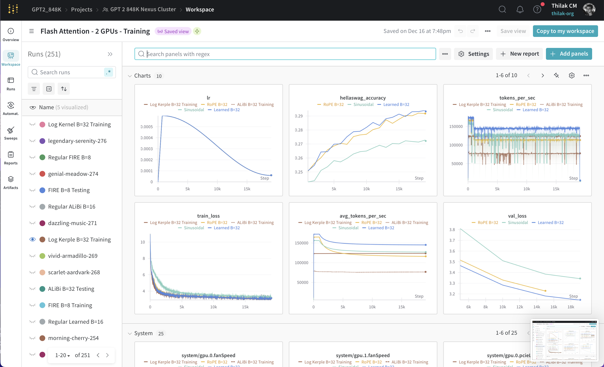

# 848K Course Project: Simplified GPT-2 with Advanced Mechanisms  

This repository contains the implementation of a **simplified GPT-2** model, developed as part of the CMSC 848K course project. The primary goal of this project is to gain a deep, intuitive understanding of GPT-2 by implementing it from scratch and experimenting with various **attention mechanisms** and **positional embeddings (PEs)**.  

## Overview  

Inspired by Andrej Karpathy's "make more" series, this project explores key advancements in transformers, such as:  
- **Attention Mechanisms:** Flash Attention, Linformer  and regular attention
- **Positional Embeddings:** RoPE, Sinusoidal, Learned PEs, ALiBi, FIRE, Kerpel  

### Key Highlights  
- **Hands-On Reproduction of Research Papers:**  
  Implementing advanced techniques like Flash Attention, Rotary Positional Embeddings (RoPE), and Linformer to understand their practical motivations and trade-offs.  

- **Comparative Analysis:**  
  Conducted systematic comparisons across various attention mechanisms and PEs using metrics such as training loss, throughput, and downstream task performance (e.g., HellaSwag accuracy).  

- **Extensive Logging with Weights & Biases (WandB):**  
  WandB enabled us to track, log, and compare experiments seamlessly. Check out our project dashboard [here](https://wandb.ai/GPT2_848K/GPT%202%20848K%20Nexus%20Cluster?nw=nwuserthilakcm212).
  This is how our wandb page looks like
  

---

## Features  

### 1. **Chat with the Models**  
Run the `chat_with_model.py` script to interact with the trained models.  
- If local `.pth` model files do not exist, the script automatically pulls them from our [Hugging Face repository](https://huggingface.co/thillsss/848k-models/tree/main).  
- Supported models: **ALiBi, RoPE, Learned PE, FIRE, Sinusoidal, Kerple**.  

### 2. **Streamlit Front-End**  
We've also built a user-friendly **Streamlit interface** for chatting with the models.  
- Run locally using `streamlit run app.py`.  
- Alternatively, try our **hosted Streamlit app** here: [https://848k-project-gpt2.streamlit.app/](https://848k-project-gpt2.streamlit.app/).  

⚠️ **Note:** Due to memory constraints (each `.pth` file is ~500MB), installing multiple models can crash the app. A reboot will have to be done. We are working on a fix for this as you read this. 

---

## Project Intentions and Goals  

- **Recreate techniques from scratch:**  
  Understand core transformer concepts like attention mechanisms and positional embeddings intuitively by implementing them step-by-step.  

- **Explore uniqueness and trade-offs:**  
  Analyze the practical motivations, strengths, and weaknesses of different techniques through systematic experimentation.  

- **Skill Development:**  
  - **PyTorch Proficiency:** Deepened expertise in implementing and debugging neural network architectures.  
  - **Tensor Manipulations:** Gained comfort in reshaping tensors, managing dimensions, and resolving mismatch errors.  
  - **Research Implementation:** Learned to systematically translate research ideas into working code.  

---

## Achievements  

- Look at submission media/ for our report and video presentation for this project.
- Successfully implemented **six positional encodings** and **three attention mechanisms**.  
- Conducted comprehensive comparative analyses across training loss, throughput, and downstream performance.  
- Built an interactive chat interface and a Streamlit app for user-friendly experimentation.  
- Leveraged WandB for efficient logging, visualization, and performance comparison.  

---

## Limitations  

- Memory constraints in the hosted Streamlit app limit the number of models loaded simultaneously.  
- High parameter count (e.g., FIRE) increases memory and compute requirements, sometimes leading to out-of-memory (OOM) errors.  

---

## Acknowledgements  

This project was developed as part of the CMSC 848K course at the University of Maryland. We extend our gratitude to Andrej Karpathy for his inspiring "make more" series and to the open-source contributors whose work laid the foundation for our implementations.  

Good luck and have fun experimenting! 🚀